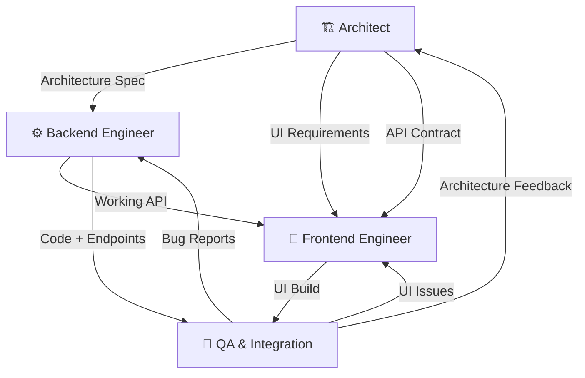

# Multi-Agent Workflow

This document describes the multi-agent AI workflow used to design, build, and validate the WebCrawler project. Four specialized agents collaborated in a structured pipeline, each with distinct responsibilities.

---

## Agent Overview

| Agent | Role | Primary Responsibility |
|-------|------|----------------------|
| 🏗️ **Architect** | System Designer | Architecture decisions, data model, concurrency strategy |
| ⚙️ **Backend Engineer** | Core Implementation | Crawler engine, search service, database, API layer |
| 🎨 **Frontend Engineer** | UI/UX Implementation | Premium SPA design, real-time dashboard, responsive layout |
| 🧪 **QA & Integration** | Validation | Testing, integration, correctness verification |

---

## Agent Definitions

### 🏗️ Architect Agent

**Prompt:**
> You are a systems architect designing a single-machine web crawler and search engine. Your responsibilities:
> 1. Define the overall system architecture including data flow, concurrency model, and persistence strategy
> 2. Choose appropriate data structures and algorithms (BFS for crawling, inverted index for search)
> 3. Design the backpressure system to manage load (rate limiting, bounded queues, worker pools)
> 4. Ensure concurrent search-while-indexing is possible at the database level
> 5. Plan for resumability after interruption
>
> Constraints: Use Python, SQLite, and language-native concurrency (threading, concurrent.futures). No distributed systems or heavy crawling libraries.

**Key Decisions Made:**
- **SQLite WAL mode** for concurrent read/write — eliminates the need for a separate database server while allowing search queries during active indexing
- **BFS with depth tracking** — natural fit for the "k hops" requirement; `deque` gives O(1) popleft
- **Three-layer backpressure**: Token bucket rate limiter (smooths bursts), bounded queue (memory ceiling), worker pool (concurrent request cap)
- **Checkpoint-based resumability** — periodic snapshots of the BFS frontier to a `pending_urls` table, visited set reconstructed from the `pages` table
- **Dual search model** — SQL LIKE for broad matches, file-based inverted index for exact word frequency scoring

**Output:** Architecture document, database schema, backpressure specification, API contract

---

### ⚙️ Backend Engineer Agent

**Prompt:**
> You are a backend engineer implementing the web crawler system. Follow the architecture specified by the Architect agent. Your responsibilities:
> 1. Implement the `crawler_service.py` with BFS crawling, ThreadPoolExecutor concurrency, token bucket rate limiter, and bounded queue
> 2. Implement the `search_service.py` with dual-mode search (keyword + relevance scoring)
> 3. Implement `database.py` with WAL mode, proper schema, and thread-safe connections
> 4. Implement `html_parser.py` with URL normalization and link extraction
> 5. Implement `app.py` as a Flask JSON API serving the SPA
>
> Ensure all shared state is protected by locks. Use `INSERT OR IGNORE` for idempotent page inserts. Handle errors gracefully without crashing the crawl loop.

**Key Implementation Details:**

1. **Token Bucket Rate Limiter** (`TokenBucketRateLimiter` class):
   - Pure Python, no external libraries
   - Tokens refill at `MAX_REQUESTS_PER_SECOND` rate
   - Workers call `acquire()` which blocks until a token is available
   - Burst capacity equals the rate (e.g., 10 tokens max)

2. **Bounded Queue**:
   - `MAX_QUEUE_DEPTH = 10000` — when exceeded, new discovered links are dropped
   - Dropped links are counted and reported in the status API (`links_dropped` metric)
   - This prevents memory exhaustion on link-heavy sites

3. **Resume Support**:
   - Every 50 pages, the BFS frontier is checkpointed to `pending_urls` table
   - On startup, `mark_interrupted_jobs()` flags any job that was `running` as `interrupted`
   - `resume_crawling(job_id)` reloads the frontier and visited set, then restarts the crawl loop

4. **Concurrency Closure Pattern**:
   - `add_done_callback` uses a closure factory (`make_callback(url)`) to avoid the classic late-binding bug where all callbacks reference the last URL

**Output:** Working Python backend (5 files)

---

### 🎨 Frontend Engineer Agent

**Prompt:**
> You are a frontend engineer building a premium web interface for the crawler system. Your responsibilities:
> 1. Create a single-page application with three tabs: Index, Search, Status
> 2. Design a dark-mode UI with glassmorphism, modern typography (Inter + JetBrains Mono), and micro-animations
> 3. Implement real-time status polling (2s interval) with animated gauges and metrics
> 4. Build search results display with depth badges, relevance bars, and "live indexing" indicator
> 5. Add toast notifications for user feedback
>
> Use only vanilla HTML, CSS, and JavaScript. No frameworks. All data comes from JSON API endpoints.

**Design Decisions:**
- **Dark mode with glassmorphism** — `rgba` backgrounds with `backdrop-filter: blur()` for depth
- **Animated gradient mesh** — subtle `radial-gradient` animation in `body::before` for visual richness
- **Color system**: Indigo (primary), Cyan (links), Emerald (success/live), Amber (warnings), Rose (errors)
- **JetBrains Mono** for all data values (metrics, URLs, scores) — readability for technical content
- **Status badges** with CSS `::before` pseudo-elements for status icons; running state uses a pulsing green dot animation
- **Queue utilization gauge** — fills with color-coded gradient (green → amber → red) based on percentage

**Output:** `index.html` (SPA) + `style.css` (design system)

---

### 🧪 QA & Integration Agent

**Prompt:**
> You are a QA engineer validating the web crawler system. Your responsibilities:
> 1. Verify the server starts without errors
> 2. Test the complete flow: submit a crawl job → monitor status → search results
> 3. Verify backpressure metrics are reported correctly
> 4. Test search returns proper (relevant_url, origin_url, depth) triples
> 5. Verify the UI renders correctly in a browser
> 6. Check that search works while indexing is active (concurrent read/write)
>
> Report any issues found and verify fixes.

**Validation Performed:**
- Server startup and database initialization ✓
- Crawl job submission and background execution ✓
- Real-time status API with backpressure metrics ✓
- Search API returning properly formatted triples ✓
- UI rendering with all interactive elements ✓
- Interrupted job detection and resume capability ✓

**Output:** Test results, bug reports, verification sign-off

---

## Agent Interaction Flow

### Communication Protocol

1. **Architect → Backend/Frontend**: Architecture decisions, schema definitions, and API contracts are passed as structured specifications. The Backend Engineer receives the internal system design; the Frontend Engineer receives the API contract and UX requirements.

2. **Backend → Frontend**: The Backend Engineer exposes a stable JSON API. The Frontend Engineer builds against this contract without needing to understand backend internals. Changes to the API surface are communicated before implementation.

3. **Both → QA**: Completed code is handed off for integration testing. The QA agent validates the system end-to-end, checking that backend APIs return correct data and the frontend correctly renders it.

4. **QA → All**: Bug reports and issues flow back to the relevant agent. Critical architecture issues escalate to the Architect for design review.

---

## Decision Log

| # | Decision | Agent | Rationale |
|---|----------|-------|-----------|
| 1 | Use SQLite with WAL mode | Architect | Enables concurrent read/write without external DB server. Perfect for "search while indexing" requirement. |
| 2 | Token bucket > simple delay | Architect | Simple `time.sleep()` doesn't smooth bursts; token bucket provides consistent rate limiting across workers. |
| 3 | Bounded queue at 10K | Architect | Prevents unbounded memory growth. 10K is large enough for most crawls but prevents catastrophic memory usage on huge sites. |
| 4 | Checkpoint every 50 pages | Backend | Balance between resume granularity and disk I/O overhead. 50 pages ≈ 5 seconds at max rate. |
| 5 | Closure factory for callbacks | Backend | Python closures capture variables by reference, not value. Without the factory, all callbacks would reference the last `url` value. |
| 6 | Single-page application | Frontend | Eliminates full page reloads between tabs. Status polling continues seamlessly. |
| 7 | Dual search model (SQL + files) | Architect | SQL LIKE search is flexible but slow for exact matching. File-based inverted index enables O(n) exact word lookup with pre-computed frequencies. |
| 8 | Dark mode with glassmorphism | Frontend | Modern, premium aesthetic. Dark backgrounds reduce eye strain for monitoring dashboards. |

---

## How This Workflow Enables the System

The multi-agent approach mirrors a real engineering team:

- The **Architect** prevented premature implementation by first solving the hardest problem (concurrent indexing + search) at the design level (WAL mode decision).
- The **Backend Engineer** focused purely on correctness and performance without worrying about presentation.
- The **Frontend Engineer** worked against a stable API contract, enabling parallel development of the UI.
- The **QA Agent** caught integration issues that no individual agent would have noticed (e.g., stale callback references, missing error handling).

This separation of concerns produced a more robust system than a single-pass implementation would have.
